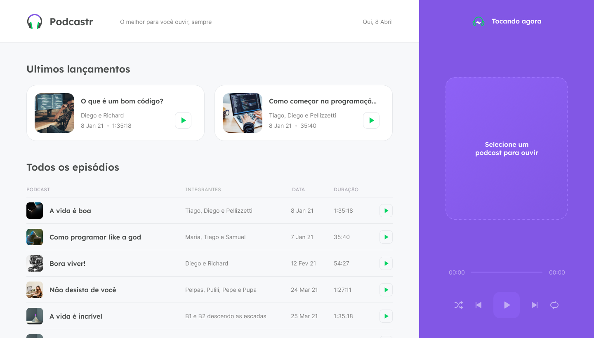

<div align="center">


_Listen to the best episodes of the FalaDev podcast!_

[Getting Started]() - [Docs]() - [My Notes]()


---

</div>

> This project was made during the [Next Level Week #5](https://nextlevelweek.com/) organized by [Rocketseat](https://rocketseat.com.br/)
>
> - prof.: [Diego Fernandes](http://github.com/diego3g)
> - date: 19/04/2021 - 23/04/2021
> - layout: [_Figma Copy Link_](https://www.figma.com/file/UwFEntsHpHYJlHNQAQr4gA/Podcastr/duplicate)

# Getting Started

_First you need to have [Node.js](https://nodejs.org/) and [Yarn Package Manager](https://yarnpkg.com/) installed._

1. Install dependencies:
```bash
$ yarn install
```
2. Start fake server
```bash
$ yarn fake-server
```
3. Start next server:
```bash
yarn start
```
> Your server will be available on http://localhost:3000

# Docs
This is a [Next.js](https://nextjs.org/) project bootstrapped with [`create-next-app`](https://github.com/vercel/next.js/tree/canary/packages/create-next-app).

## Pages
### Home: `/`



### Episode Details: `/episodes/episode-slug`


## Back-End

The fake server use the package [json-server](https://www.npmjs.com/package/json-server) to start a back-end server for development. The data of this back-end is on [`server.json`](server.json) file.6

To use other back-end server, change the `baseURL` on [`src/services/api.ts`](src/services/api.ts) with your back-end server url.

## Learn More

To learn more about Next.js, take a look at the following resources:

- [Next.js Documentation](https://nextjs.org/docs) - learn about Next.js features and API.
- [Learn Next.js](https://nextjs.org/learn) - an interactive Next.js tutorial.

You can check out [the Next.js GitHub repository](https://github.com/vercel/next.js/) - your feedback and contributions are welcome!